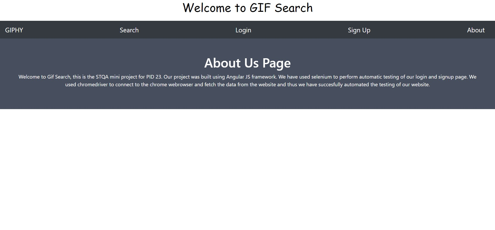

# Gifsearch

This project was generated with [Angular CLI](https://github.com/angular/angular-cli) version 11.0.2.

## Development server

Run `ng serve` for a dev server. Navigate to `http://localhost:4200/`. The app will automatically reload if you change any of the source files.

## About Application

This application was created for purposes of performing functional testing using selenium tool. The main idea behind the creation was to make
an application that uses the GIPHY API to fetch gifs from the GIPHY database with additional functionality of account creation. The web application is purely a front end with no backend server attached and was created solely for demonstration purposes.

### Home Page

The home page is an html which renders on clicking the `GPIHY` tab on the navigation bar. It's the default loading page and uses an angular service which injects into the component to fetch __Trending gifs__ that are currently in the __GIPHY__ database. The functionality of this tab is to just show rendered GIFs that are trending.

### Search Page

The Search component can be accessed by clicking on the `Search` tab on the navigation bar. The functionality of the search bar is to enable user to search for gifs with appropriate __keywords__ and fire queries based on those keywords. This component uses the same service as the __Home Page__ component. The query is fired as an __http request__ using the __GIPHY API__ and the response is rendered onto the html page. If the response returns a __null object__, the page displays appropriate `Results not found` message.

Upon successful completion of the query, the data object received is rendered in the html.

### Login Page

The login page is a standard login page with `username` & `password` entry fields. A user can login if he has already signed up before. If not, the login fails and the user is asked to sign up. The login page uses angular forms for input validation and has user feedback in real-time to show errors while the user enters the details. An example would be empty fields.

As observed, the login button is disabled until user correctly enters the information. If the user is an already registered user, the page displays `success` to indicate a successful login attempt.

If the user enters the wrong password, the page displays appropriate `Incorrect password` message. If the user doesn't exist as a registered user, the page asks the user to sign up before proceeding.

### Sign Up Page

The sign up page is a regular sign up page that requires the user to enter details such as __name, username, email, password__. It has the same input validation using Angular forms that the login component has.

As observed, the `Sign Up` button us also disabled until the user enters appropriate information which is required. Once registered, the user can log into the account. If an already registered user attempts to re-register, an error is thrown.

### About Page

The about page contains the information about the project and the purpose of creating the project briefly unlike this README. If you've come this far along, please take a look

## Testing

The following section will briefly summarize the testing carried out using the Selenium testing tool. The test cases have been documented and the output can be found in the [testing/outputs](/testing/outputs) folder. 

For example,

### Login Testing :

Test 1 :Login Form validation  
Case : username : shreyas
  &nbsp;&nbsp;&nbsp;&nbsp;&nbsp;&nbsp;&nbsp;&nbsp;&nbsp;&nbsp;password : password
 
Output : Success  
Test Case Output :Success
  Result : Pass
 
### Sign-Up Testing :

Test 1 :Sign up validation  
Case : username : raju
    &nbsp;&nbsp;&nbsp;&nbsp;&nbsp;&nbsp;&nbsp;&nbsp;&nbsp;&nbsp;email : raju@xyz.com
    &nbsp;&nbsp;&nbsp;&nbsp;&nbsp;&nbsp;&nbsp;&nbsp;&nbsp;&nbsp;password : 12345
    &nbsp;&nbsp;&nbsp;&nbsp;&nbsp;&nbsp;&nbsp;&nbsp;&nbsp;&nbsp;username : raju
 
Output : Success  
Test Case Output :Success
  Result : Pass
 
### Search Testing :

Test 1 :Search validation  
Case : car
 
Output : GIFs   
Test Case Output :GIF link stored in search.txt
  Result : Pass
